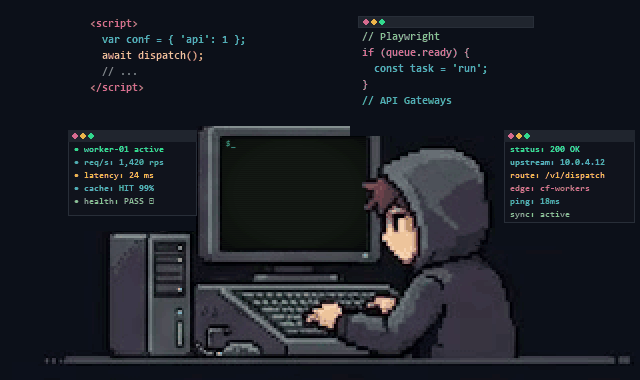

  <h1>👨‍💻 Hi there, I'm Allan</h1>

  

    
  

  

    <samp>📍 US · 在白班与夜班的交替中写代码</samp> 
    <samp>⚡ Web 自动化 / 服务端架构 / LINUX DO 常驻</samp>  
    <strong>「 万物皆可 API 」</strong> 
    把重复交给自动化，把复杂留在接口背后。
  

   

  <!-- 8.0s 像素复古 CRT 极客打字终端动图 -->
  

    
  

---

### 🚀 探索与实践 · About Me

- ⚡ **高并发自动化流水线**：使用 Playwright + 自研本地 API 编排分布式浏览器工作流，支持多账号并发执行与任务容错自愈。
- 🔗 **跨端协同与底层交互**：深度结合 C# 原生系统性能与 Node.js 异步生态，打通桌面宿主底层、协议交互与 Web 前端数据壁垒。
- 🌐 **API 网关与架构治理**：实践 NewAPI 等高可用网关体系，实现企业级反代路由、高并发负载调优与全链路请求监控。
- ☁️ **边缘计算与网络分发**：利用 Cloudflare Workers 边缘调度，结合 Nginx 性能优化与节点异常自动巡检自愈。

---

### 🛠️ 核心技术栈 · Tech Stack

  
  

    <samp style="letter-spacing: 2px;">BUILD · AUTOMATE · CONNECT</samp>
  

---

### 🥷 幕后代码 · Private Work

> 我的大部分核心业务代码都在 `Private` 状态下平稳运行。公开仓库之外，持续打磨以下企业级系统：

- 📦 **企业级通信后端**：从零搭建的高并发数据分发网关，主打低延迟、高吞吐与容灾稳定性。
- 🖥️ **跨端自动化引擎**：以 C# 驱动桌面底层与硬件交互，通过 WebSocket / RPC 无缝串联云端服务。
- 🛠️ **DevOps 巡检套件**：围绕服务器集群编写自动化监控告警、自动化部署与异常自愈运维脚本。

---

### 🤝 建立连接 · Let's Connect

  
  &nbsp;&nbsp;&nbsp;
  

